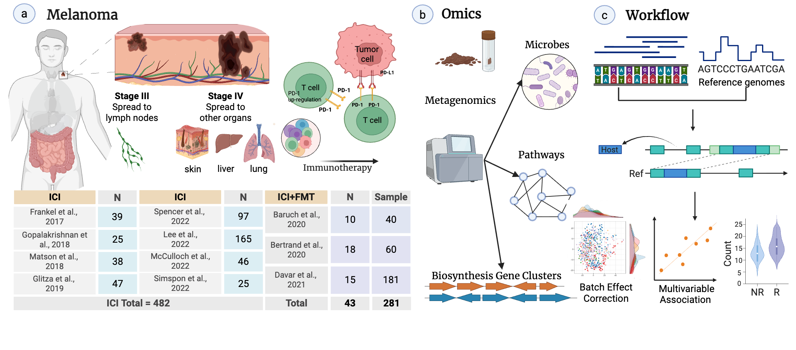
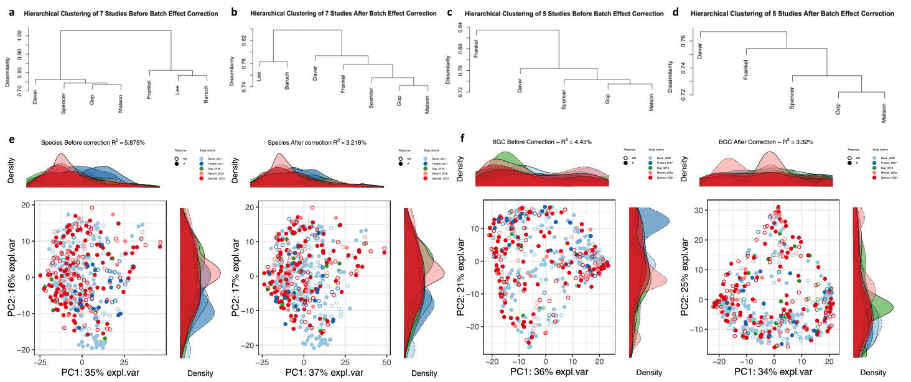
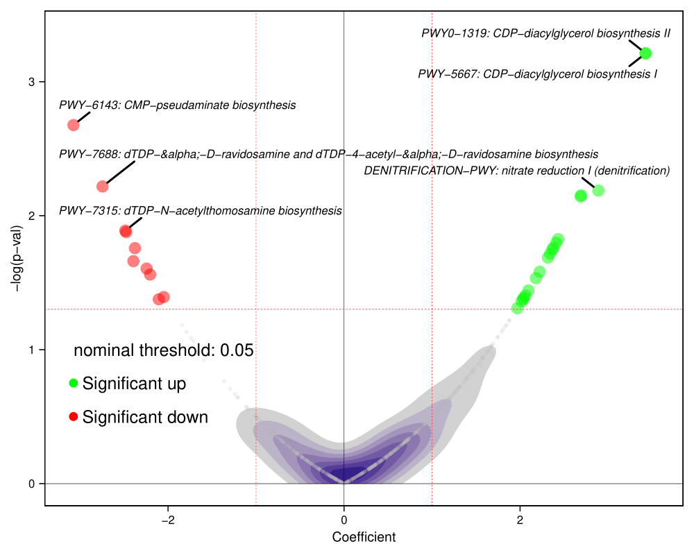
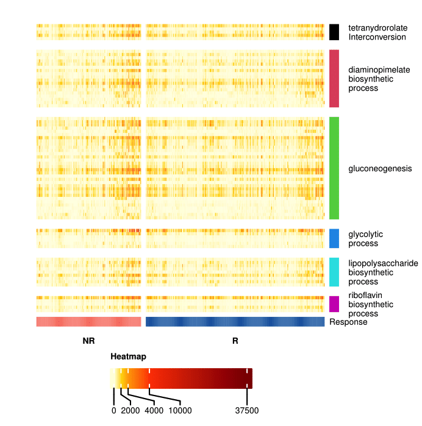

# Meta-analytic microbiome target discovery for immune checkpoint inhibitor response in advanced melanoma 
This repository includes a set of analyses and visualization for a project entitled "Meta-analytic microbiome target discovery for immune checkpoint inhibitor response in advanced melanoma". 
## Overview

This repository contains a reproducible computational pipeline for conducting a meta-analysis of metagenomic samples in melanoma immunotherapy. Our study integrates microbial species, biosynthetic gene clusters (BGCs), and functional pathways across multiple datasets to identify key microbial signatures associated with immune checkpoint inhibitor (ICI) response.

### Citation
If you use this pipeline in your research, please cite our study:
> **Zhang, X., Mallick, H. & Rahnavard, A.** Meta-analytic microbiome target discovery for immune checkpoint inhibitor response in advanced melanoma. *bioRxiv* **2025**, 2025.03.21.644637 (2025). [https://doi.org/10.1101/2025.03.21.644637](https://doi.org/10.1101/2025.03.21.644637).

## Key Features 

- **Comprehensive Meta-Analysis**: The comprehensive meta-analysis of metagenomic samples in melanoma immunotherapy(N=678).
- **Identification of Secondary Metabolites**: Novel discovery of secondary metabolites linked to immunotherapy response.
- **Biomarker Discovery**: _Faecalibacterium_ SGB15346 identified as a potential biomarker for ICI response.
- **Functional Insights**: _RiPP_ biosynthetic gene clusters and Enterobacteriaceae-associated BGCs enriched in responders.
- **Reproducible Analysis Pipeline**: A standardized and reproducible workflow for future research applications.
## Data Collection
We compiled publicly available whole metagenome shotgun sequencing (MGS) datasets from melanoma patients receiving immunotherapy. The following studies were included:

- GopalakrishnanV_2018 (PRJEB228939)
- MatsonV_2018 (PRJNA3997428)
- FrankelAE_2017 (PRJNA39790610)
- SpencerCN_2021 (PRJNA77029513)
- BaruchEN_2021 (PRJNA67873712)
- DavarD_2021 (PRJNA67286711)
- LeeKA_2022 (PRJEB431196)

## Melanoma metagenomic samples

Table 1 summarizes melanoma metagenomic datasets included in this study and compares them with recent meta-analyses.

| Melanoma Study / Meta-analysis Study | Our study | Cai et al. 2025 | Zhu et al. 2025 | Zhang et al. 2025 | Olekhnovich et al. 2023 | Lee et al. 2022 | Limeta et al. 2020 |
|---|---:|---:|---:|---:|---:|---:|---:|
| Gopalakrishnan et al., 2017 | 25 | 25 | 0 | 0 | 25 | 25 | 25 |
| Matson et al., 2018 | 38 | 38 | 0 | 38 | 38 | 38 | 38 |
| McCulloch et al., 2022 | 46 | 46 | 46 | 46 | 0 | 0 | 0 |
| Lee et al., 2022 - UK | 55 | 55 | 0 | 55 | 55 | 55 | 0 |
| Lee et al., 2022 - Netherlands | 55 | 55 | 0 | 55 | 55 | 55 | 0 |
| Lee et al., 2022 - Manchester | 25 | 25 | 0 | 25 | 25 | 25 | 0 |
| Lee et al., 2022 - Leeds | 18 | 18 | 0 | 18 | 18 | 18 | 0 |
| Lee et al., 2022 - Barcelona | 12 | 12 | 0 | 12 | 12 | 12 | 0 |
| Spencer et al., 2021 | 97 | 0 | 0 | 97 | 97 | 0 | 0 |
| Frankel et al., 2017 | 39 | 0 | 0 | 39 | 39 | 39 | 39 |
| Simpson et al., 2022 | 25 | 0 | 0 | 0 | 0 | 0 | 0 |
| Glitza et al., 2024 | 47 | 0 | 0 | 0 | 0 | 0 | 0 |
| Zhu et al. 2025 | 0 | 0 | 165 | 0 | 0 | 0 | 0 |
| Wind et al., 2020 | 0 | 0 | 0 | 0 | 0 | 25 | 0 |
| *Davar et al., 2021 | 181 | 0 | 181 | 0 | 181 | 0 | 0 |
| *Baruch et al., 2020 | 40 | 0 | 40 | 0 | 40 | 0 | 0 |
| *Bertrand et al., 2019 | 60 | 0 | 0 | 0 | 0 | 0 | 0 |
| **ICI Total / *ICI+FMT Total** | **482 / 281** | **274 / 0** | **211 / 221** | **385 / 0** | **364 / 221** | **292 / 0** | **102 / 0** |

## Workflow

### 1. Quality Control & Preprocessing

- Removal of host DNA sequences using **KneadData**.

- Quality filtering and trimming with **fastp**.

- Taxonomic profiling via **MetaPhlAn 4**.

### 2. Functional Analysis

- Pathway Analysis: Conducted using **HUMAnN3** to identify enriched pathways.

- Biosynthetic Gene Clusters (BGCs): Identified using **antiSMASH 7.0** and **BGCLens**.

- Gene Families: Annotated using **omePath**.

### 3. Beta Diversity and Batch Effect Correction

- Bray-Curtis Dissimilarity: Used to assess inter-study variability.

- Batch Effect Correction: Performed using `MMUPHin.R`.

### 4. Meta-Analysis & Statistical Modeling

- Statistical associations analyzed using MaAsLin2 within `MMUPHin.R`.

- Compound Poisson Linear Model (CPLM) applied to identify significant microbiome features.

- PERMANOVA used to quantify variance explained by batch effects.

### 5. Data Visualization

- Volcano Plot: Run `volcano_plot.R` to visualize differentially abundant taxa or pathways.

- Heatmap: Use `heatmap.R` to generate heatmaps for significant associations.

## Key Findings

- **_Faecalibacterium_ SGB15346** is significantly enriched in responders across multiple studies.

- **RiPP biosynthetic gene clusters** exhibit increased abundance in responders.

- **dTDP-sugar biosynthesis pathways** correlate with non-response.

- Batch effect correction successfully reduced inter-study variability while preserving biological signals.

## Contact

For questions, please open an issue or contact [Ali Rahnavard](mailto\:rahnavard@email.gwu.edu), [Himel Mallick](mailto\:him4004@med.cornell.edu) or [Xinyang Zhang](mailto\:xinyangz@gwu.edu).
## License

This project is licensed under the MIT License - see the LICENSE file for details.

